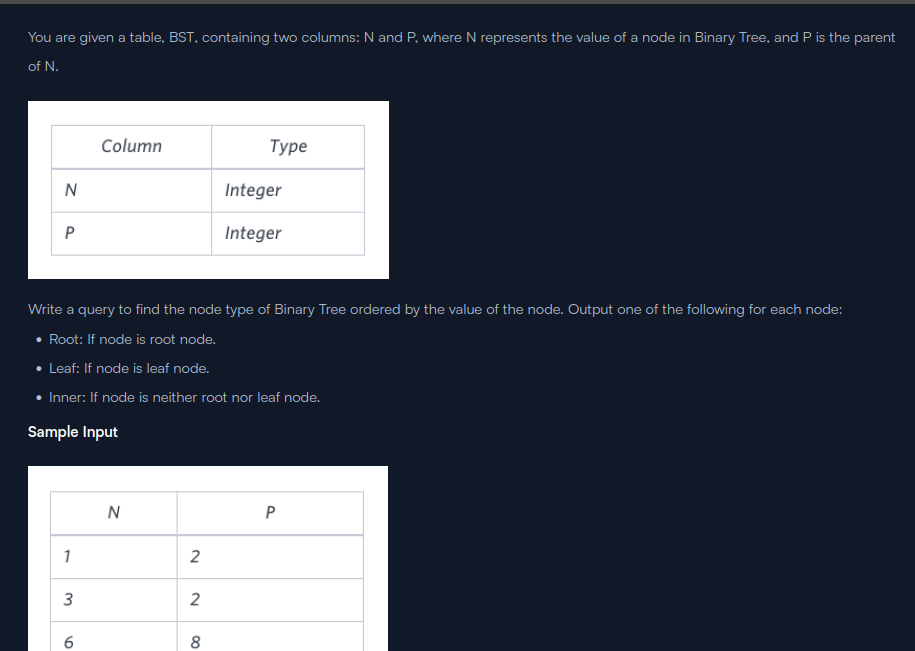
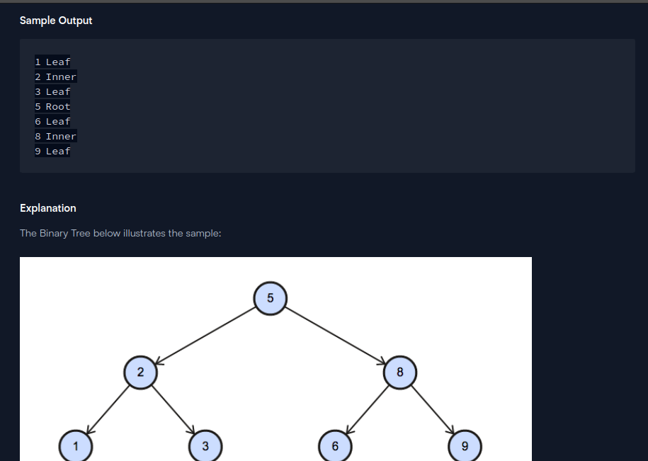

```
select N, if(P is NULL, 'Root',if(N IN (select P from BST), 'Inner','Leaf')) from BST ORDER BY N
```
```
SELECT N, (CASE WHEN N IN (SELECT P FROM BST WHERE P <>(SELECT N FROM BST WHERE P IS NULL) ) THEN 'Inner' WHEN N = (SELECT N FROM BST WHERE P IS NULL) THEN 'Root' ELSE 'Leaf' END) AS NT FROM BST ORDER BY N;
```
```
select distinct(b1.n), case
when b1.p is null then "Root"
when b2.p is null then "Leaf"
else "Inner"
end
from bst as b1 left join bst b2 on b1.n = b2.p order by b1.n
```
```
select N, case when P IS NULL then 'Root' when N in (select P from BST) then 'Inner' Else 'Leaf' end from BST order by N asc
```