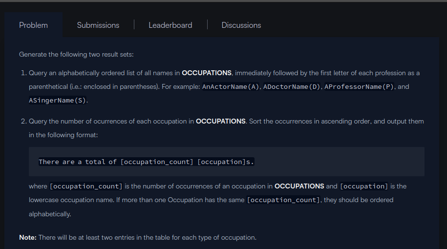
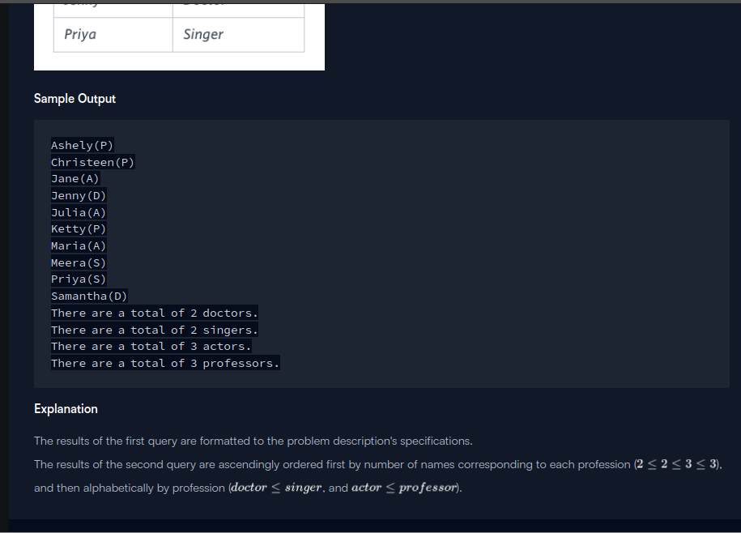

```
select 
concat(Name, "(", (SUBSTR(Occupation,1,1)), ")" ) 
from OCCUPATIONS
ORDER BY NAME ASC;

select 
concat("There are a total of ", count(Occupation), " " , Lower(Occupation),"s.") 

from OCCUPATIONS 
GROUP BY occupation
ORDER BY Count(Occupation), Occupation;

```
```
select concat(name,'(',(SUBSTR(Occupation,1,1)),')') from occupations order by name asc;
select concat('There are a total of ',count(occupation),' ',lower(occupation),'s.') from occupations group by occupation 
order by count(occupation),occupation;
```