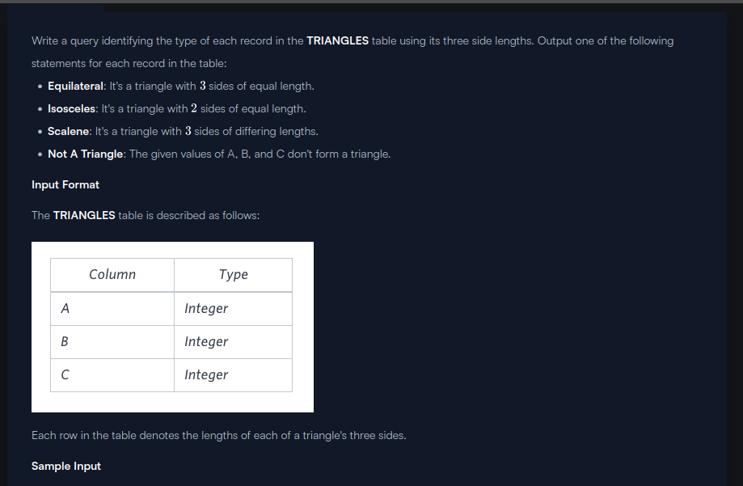
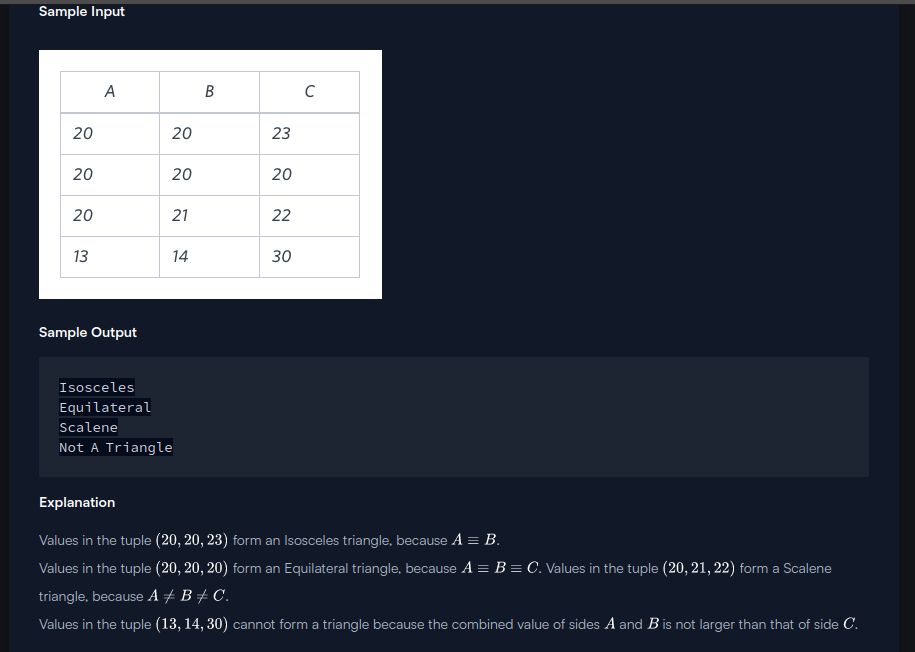

```

SELECT 
CASE 
    WHEN ((A+B <= C) OR( B+C <= A) OR( C+A <= B)) 
        THEN 'Not A Triangle' 
    WHEN (A=B AND B=C AND C=A) 
        THEN 'Equilateral' 
    WHEN (A=B OR B=C OR C=A) 
        THEN 'Isosceles' 
    WHEN (A<>B AND B<>C AND C<>A) 
        THEN 'Scalene'
END 
FROM TRIANGLES;

```
```
select case
    when ((a+b<=c) or (b+c<=a) or (c+a<=b))
        then 'Not A Triangle'
    when (a=b and b=c and c=a)
        then 'Equilateral'
    when (a=b or b=c or c=a)
        then 'Isosceles'
    when (a<>b and b<>c and c<>a)
        then 'Scalene'
end
from triangles;
```